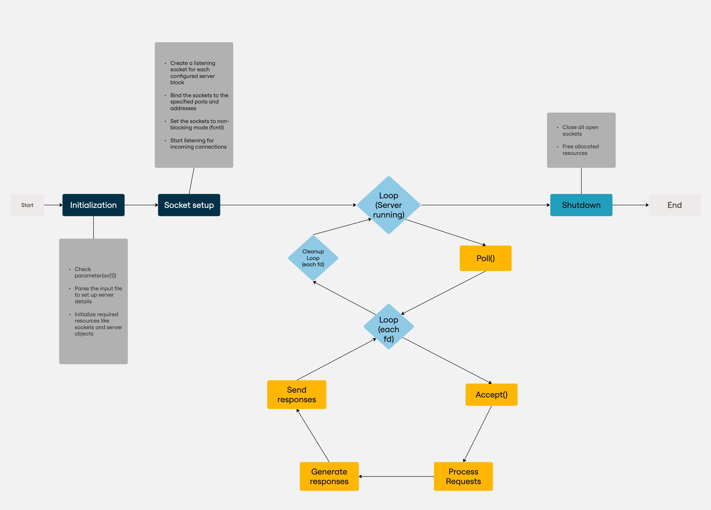

# Webserv

> **Versions**: [English](#webserv) | [Français](#webserv-fr) | [한국어](#webserv-ko)

## Table of Contents

- [Introduction](#introduction)
- [Features](#features)
- [Usage](#usage)
- [Configuration](#configuration)
- [Request Handling](#request-handling)
- [Error Handling](#error-handling)
- [Supported HTTP Methods](#supported-http-methods)

---

## Introduction

**Webserv** is an Ecole 42 project that involves building a simple HTTP server in C++98. Inspired by Nginx, Webserv handles client requests, serves static files, and supports dynamic content processing. Through **Webserv**, you will gain hands-on experience with socket programming, HTTP parsing, multiplexing, and server configurations. With two great teammates, Kelly Brener-Raffali [https://github.com/KellyBRENER] and Daram Bae [https://github.com/darambae], we successfully completed this team project with a score of 125%.
For the full history of the project, you can refer to Daram's repository : [https://github.com/darambae/Webserv]

---

## Features

- **Multi-Client Handling**: Uses non-blocking sockets and `poll()` for handling multiple clients simultaneously.
- **HTTP/1.1 Support**: Implements core HTTP features such as request parsing, response handling, and status codes.
- **Configurable Server**: Reads settings from a configuration file to define server behavior (ports, routes, error pages, etc.).
- **Static File Serving**: Serves HTML, CSS, JavaScript, and other static resources.
- **CGI Support**: Executes scripts like PHP or Python via the Common Gateway Interface (CGI).
- **Error Management**: Returns proper HTTP status codes for incorrect requests or missing resources.

---

## Usage

To compile and run the server:

```bash
make
./webserv config/filename
```

**Examples**:

- Starting the server with a configuration file:
  ```bash
  ./webserv config/filename
  ```
- Sending a GET request to fetch an HTML file:
  ```bash
  curl http://localhost:8080/
  ```
- Sending a POST request to upload data:
  ```bash
  curl -X POST -d "filename=test" http://localhost:8080/upload
  ```

---

## Configuration

Webserv uses a configuration file to define:

- **Listening Ports**: Specify which ports the server should listen on.
- **Server Blocks**: Define multiple virtual hosts.
- **Root Directory**: Set the document root for serving files.
- **Error Pages**: Customize responses for different HTTP status codes.
- **CGI Scripts**: Configure paths for executing scripts.

**Example Configuration File:**

```conf
server {
    listen 8080;
    server_name myserver;
    root /var/www/html;
    index index.html;
    error_page 404 /errors/404.html;
    
    location /cgi-bin/ {
        cgi_pass /usr/bin/python3;
        cgi_extension .py;
    }
}
```

---

## Flowchart


## Request Handling

1. **Client Connection**: The server accepts incoming TCP connections.
2. **Request Parsing**: Reads and parses the HTTP request (method, headers, body).
3. **Routing**: Matches the request URL with configured routes.
4. **Response Generation**:
   - Static files are read and returned.
   - CGI scripts are executed, and output is returned.
   - Proper status codes are sent based on request validity.
5. **Response Delivery**: The response is sent back to the client.
6. **Connection Closure**: The connection is closed if needed.

---

## Error Handling

- **400 Bad Request**: Invalid or malformed request.
- **404 Not Found**: Requested file or directory does not exist.
- **405 Method Not Allowed**: HTTP method not supported.
- **408 Request Timeout**: The server timed out waiting for the client to send a complete request within the allowed time.
- **413 Payload Too Large**: The server is refusing to process a request because the request payload exceeds the server's configured limit.

---

## Supported HTTP Methods

### `GET`

- **Usage**: Requests a resource from the server.
- **Example**:
  ```bash
  curl http://localhost:8080/
  ```

### `POST`

- **Usage**: Sends data to the server (e.g., form submissions, file uploads).
- **Example**:
  ```bash
  curl -v -F "avatar=@408.jpg" http://localhost:8080/upload
  ```

### `DELETE`

- **Usage**: Requests the removal of a resource from the server.
- **Example**:
  ```bash
  curl -X DELETE http://localhost:8080/upload/coton.jpg -d "fileName=coton.jpg"
  ```

---

# Webserv FR

## Table des Matières

- [Introduction](#introduction)
- [Fonctionnalités](#fonctionnalités)
- [Configuration](#configuration)
- [Traitement des Requêtes](#traitement-des-requêtes)
- [Méthodes HTTP Prises en Charge](#méthodes-http-prises-en-charge)

## Introduction

**Webserv** est un projet de l'École 42 visant à développer un serveur HTTP simple en C++98. Inspiré de Nginx, Webserv gère les requêtes clients, sert des fichiers statiques et prend en charge le traitement dynamique des contenus.

Avec mes deux coéquipieres, Kelly Brener-Raffali [https://github.com/KellyBRENER] et Daram Bae [https://github.com/Gotgotd], nous avons réussi ce projet d'équipe avec un score de 125 %.
Pour l'historique complet du projet, vous pouvez vous référer au repository de Daram : [https://github.com/darambae/Webserv]

---

## Fonctionnalités

- **Gestion Multi-Clients** : Utilisation de sockets non bloquants et de `poll()`.
- **Support HTTP/1.1** : Implémente les fonctionnalités de base du protocole HTTP.
- **Configuration Personnalisable** : Lecture d'un fichier de configuration pour définir les paramètres du serveur.
- **Support CGI** : Exécution de scripts PHP ou Python via CGI.
- **Gestion des Erreurs** : Réponses adaptées avec les codes HTTP appropriés.

---

## Configuration

**Exemple de fichier de configuration :**

```conf
server {
    listen 8080;
    server_name monserveur;
    root /var/www/html;
    index index.html;
    error_page 404 /errors/404.html;
}
```

---

## Traitement des Requêtes

1. **Connexion Client** : Acceptation de la connexion.
2. **Analyse de la Requête** : Lecture et traitement des entêtes HTTP.
3. **Routage** : Correspondance de l'URL avec les routes configurées.
4. **Génération de la Réponse** :
   - Envoi d'un fichier statique.
   - Exécution d'un script CGI.
   - Gestion des codes d'erreur.
5. **Envoi de la Réponse** : Transmission au client.
6. **Fermeture de la Connexion**.

---

## Méthodes HTTP Prises en Charge

### `GET`

- **Utilisation** : Récupération d'une ressource.

### `POST`

- **Utilisation** : Envoi de données au serveur (téléversement d'une image).

### `DELETE`

- **Utilisation** : Suppression d'une ressource (suppression de l'image téléversée).
- ***Remarque*** : Les formulaires HTML ne prennent pas en charge la méthode DELETE, donc la suppression est gérée en utilisant le nom et la valeur des champs du formulaire.
---

# Webserv KO

## 목차

- [소개](#소개)
- [기능](#기능)
- [설정](#설정)
- [요청 처리 과정](#요청-처리-과정)
- [지원되는 HTTP 메소드](#지원되는-http-메소드)

---

## 소개

**Webserv**는 Ecole 42 프로젝트로, C++98을 사용하여 간단한 HTTP 서버를 구축하는 과제입니다. Nginx의 작동방식을 토대로 클라이언트 요청을 처리하고 정적 파일을 제공하며, python과 php로 작성한 CGI 프로그램을 통해 동적 콘텐츠를 처리하였습니다. 저희는 구글 크롬을 프로젝트의 기본 브라우저로 사용하였고, 리눅스 우분투에서 실행이 가능합니다.
훌륭한 두 팀원들, Kelly Brener-Raffali [https://github.com/KellyBRENER]와 Gautier Daigneau [https://github.com/Gotgotd] 덕분에 프로젝트를 성공적으로 완료하여 125%의 점수를 받았습니다.

---

## 기능

- **다중 클라이언트 처리**: 비동기 소켓과 `poll()`을 사용하여 다중 요청을 처리합니다.
- **HTTP/1.1 지원**: 요청 파싱, 응답 처리 및 상태 코드 구현.
- **구성 가능 서버**: 설정 파일을 통해 포트, 루트 디렉토리, 오류 페이지 등을 정의할 수 있습니다.
- **정적 파일 제공**: HTML, CSS, JavaScript 및 기타 정적 리소스를 제공합니다.
- **CGI 지원**: PHP 및 Python 스크립트 실행 가능.
- **오류 관리**: 올바르지 않은 요청이나 누락된 리소스에 대해 적절한 HTTP 상태 코드를 반환합니다.

---

## 설정

**예제 설정 파일:**

```conf
server {
    listen 8080;
    server_name myserver;
    root /var/www/html;
    index index.html;
    error_page 404 /errors/404.html;
}
```

---

## Flowchart


## 요청 처리 과정

1. **클라이언트 연결**
2. **요청 파싱**
3. **라우팅 처리**
4. **응답 생성**
5. **응답 전송**
6. **연결 종료**

---

## 지원되는 HTTP 메소드

### `GET`

- **사용법**: 리소스 요청.

### `POST`

- **사용법**: 이미지 파일 업로드 및 바디에 포함된 데이터 전송.

### `DELETE`

- **사용법**: 업로드한 이미지 파일을 삭제.
- ***주의 사항***: html의 form은 delete method를 지원하지 않아, form의 name과 value를 이용해 delete을 처리함.


